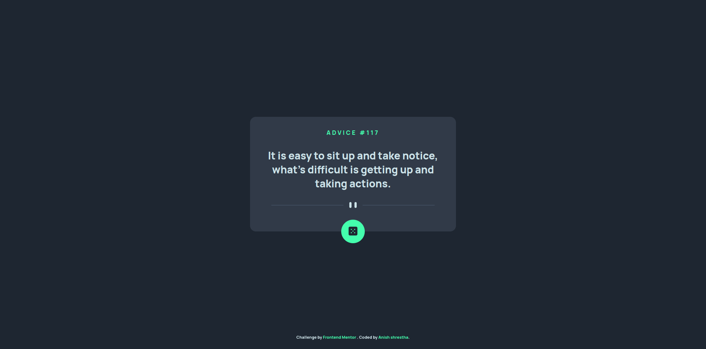
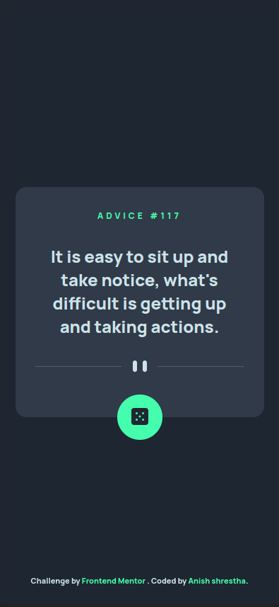

# Frontend Mentor - Expenses chart component solution

This is a solution to the [Expenses chart component challenge on Frontend Mentor](https://www.frontendmentor.io/challenges/expenses-chart-component-e7yJBUdjwt). Frontend Mentor challenges help you improve your coding skills by building realistic projects.

## Table of contents

- [Frontend Mentor - Expenses chart component solution](#frontend-mentor---expenses-chart-component-solution)
  - [Table of contents](#table-of-contents)
    - [The challenge](#the-challenge)
    - [Screenshot](#screenshot)
    - [Links](#links)
    - [Built with](#built-with)
    - [What I learned](#what-i-learned)
  - [Author](#author)

### The challenge

Users should be able to:

- View the optimal layout for the app depending on their device's screen size
- See hover states for all interactive elements on the page
- Generate a new piece of advice by clicking the dice icon

### Screenshot

Desktop

Mobile

  

### Links

- Solution URL: [Solution Repo](https://github.com/VoidArchive/Frontend-Mentor-Challanges/tree/main/003)
- Live Site URL: [Live Site](https://expense-tracker-seven-gamma.vercel.app/)

### Built with

- Semantic HTML5 markup
- CSS custom properties
- Flexbox
- CSS Grid
- Svelte

### What I learned

- How to fetch API in svelte.
- Use on:click instead of onclick. This took me hours to figure out why my button was not working.

## Author

- Website - [Anish Shrestha](https://www.github.com/Voidarchive)
- Frontend Mentor - [@voidarchive](https://www.frontendmentor.io/profile/VoidArchive)
